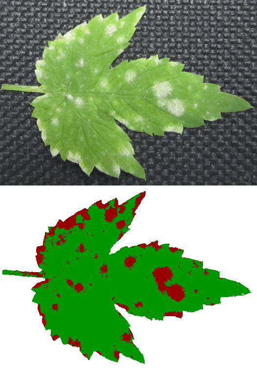
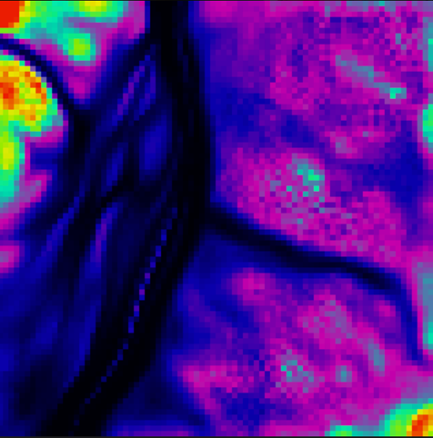
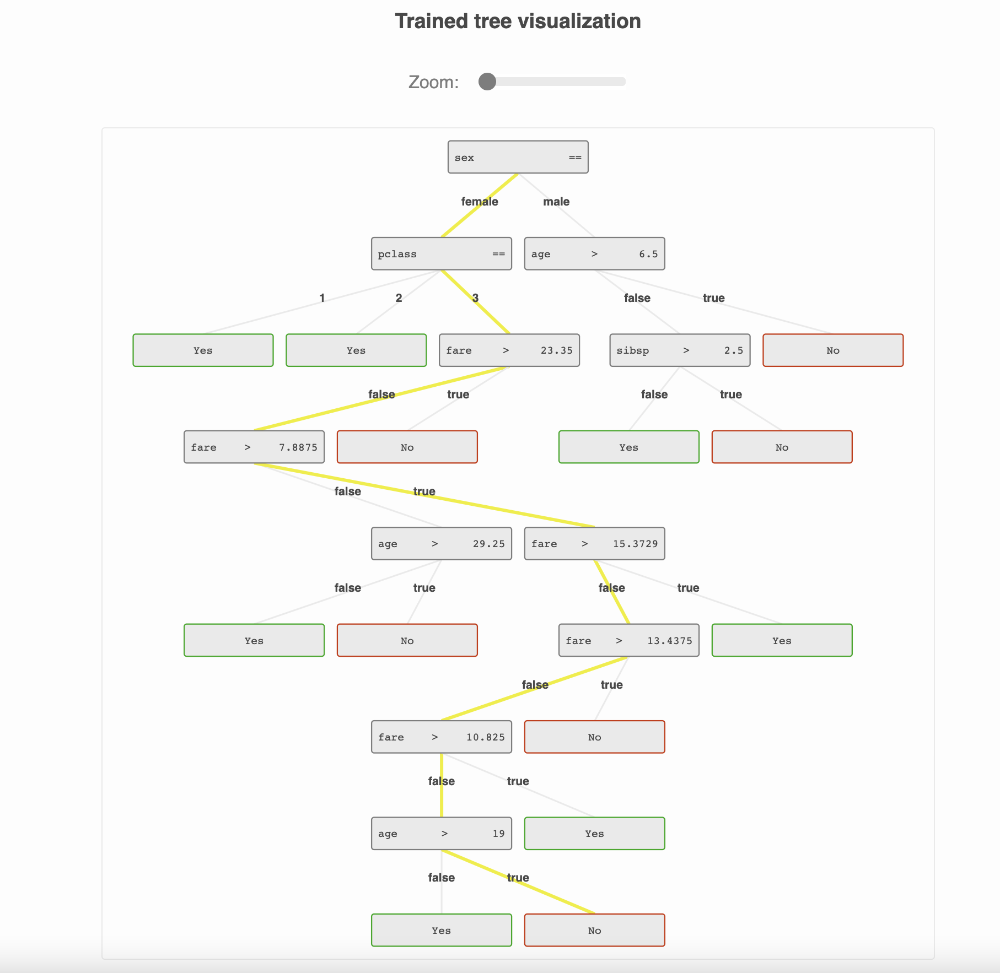

## Michal Oboril 
___

### Contact & Basics

**Contact:** &nbsp;michal.miob@gmail.com

**Date of birth:** &nbsp; after The First Crusade, before Justin Bieber

**Place:** &nbsp; Southern Moravia, Czech Republic

**Git:** &nbsp;https://github.com/miob-miob

---

### Who I am?

I am enthusiastic software engineer with 9 years of experience designing and 
implementing web applications, native applications and scientific applications. 
I would classify myself as full stack developer, more involved in frontend technologies last years.
I am also strongly interested in machine learning, devops, minimalistic design and life sciences (Once a scientist, always a scientist).

---

### Education

*2010 - 2019* &nbsp;**Biochemistry** - Masaryk University Brno, faculty of science &nbsp;-&nbsp; achieved **PhD** degree

*2008 - 2010* &nbsp;**Biochemistry** - Masaryk University Brno, faculty of science  &nbsp;-&nbsp; achieved **master** degree

*2005 - 2008* &nbsp;**Applied biochemistry** - Masaryk University Brno, faculty of science  &nbsp;-&nbsp; achieved **bachelor** degree

---

### Job Log

* *2020 - present* &nbsp;&nbsp;  **Currys (Dixons Carphone) - Tech lead** 
    * Technical design, architecture, some non-trivial implementations and integrations of mobile application for colleagues in Currys stores.
    * Leadership and development of team of software engineers and QA engineers (up to 8 people) 
    * Tech stack: React, React-Native, Node.js, Nest.js, Postgres, bit of Swift and devops stuff...
  

* *2018 - 2020* &nbsp;&nbsp; **Currys (Dixons Carphone) - Senior Developer** 
  * Technical design, implementation of mobile application for colleagues in Currys stores.
  * Tech stack: React, React-Native, Node.js, Nest.js, Postgres
  

* *2017 - 2018* &nbsp;&nbsp; **Currys (Dixons Carphone) - Developer**
  * implementation of mobile application for colleagues in Currys stores
  * Tech stack: React, React-Native, Node.js, Nest.js, Postgres
  

* *2014 - 2017* &nbsp;&nbsp;  **Ceitec MU - Proteomics core facility - Researcher**
  * Full stack development of complex information system for proteomics laboratory
  * Development of pipeline for mass spectrometry data automated processing and reporting to customers.
  * Leadership of one informatics graduate
  * Tech stack: Django, Backbone js, jquery
  

* *2012 - 2014* &nbsp;&nbsp;  **Masaryk University - Biochemistry department - Researcher**
  * Development of plant issues necrosis detection tool based on neural networks.
  * Example generator for automated students testing.
  * Various pieces of software/scripts for science purposes. 
  * Tech stack: C, Python
  

---

### Experience (sometimes you win sometimes you learn)

|Technology|Level|Note|
|---|---|---|
||||
|**Languages**|
|Python| +++ |Production experience - *some time ago* |
|Javascript + Typescript| +++ | Production experience|
|C|++| Science experience - neural network - in pre tensorflow times, Kohonen maps|
|Swift|++| Production experience|
|C++|+|Arduino micro controllers|
|Ruby|+|Hacking some fastlane, Ruby Warrior |
|Fortran|+ | Long time ago... do not ask why... |
||||
|**Frameworks + technologies**|||
|Django|+++|Backend of information system for lab - bit outdated|
|React/redux, React-native, Node js,Nest js, express js+ ecosystem|+++|Tech stack of most recent job - app for colleagues in stores|
|Gitlab|+++|CI/CD pipelines for various repos|
|Docker/Docker Swarm|+++| Must have for current job|
|Terraform|+|Some production experience|
|||
|**Databases**|||
|SQL|+|Some production experience with oracleDB, postgres|
|No SQL|++|Lot of POCs on Mongo DB (love) and couchbase - but no opportunity on big project yet.|
||||
|**Other**|||
|oAuth,oidc|++|Implemented several times for various applications|
|Web development in general|+++||
|Machine learning|+|Mastered some of ML algorithms MLP, SOM, decision trees|

---

### Visually appealing outputs

Leaf necrosis classifier:

---

Kohonen map (SOM) - density map

---

[TreeGardenVisualization](https://github.com/miob-miob/treeGardenVisualization)

---

### Civil Roles

* triple father
* musician
* climber

